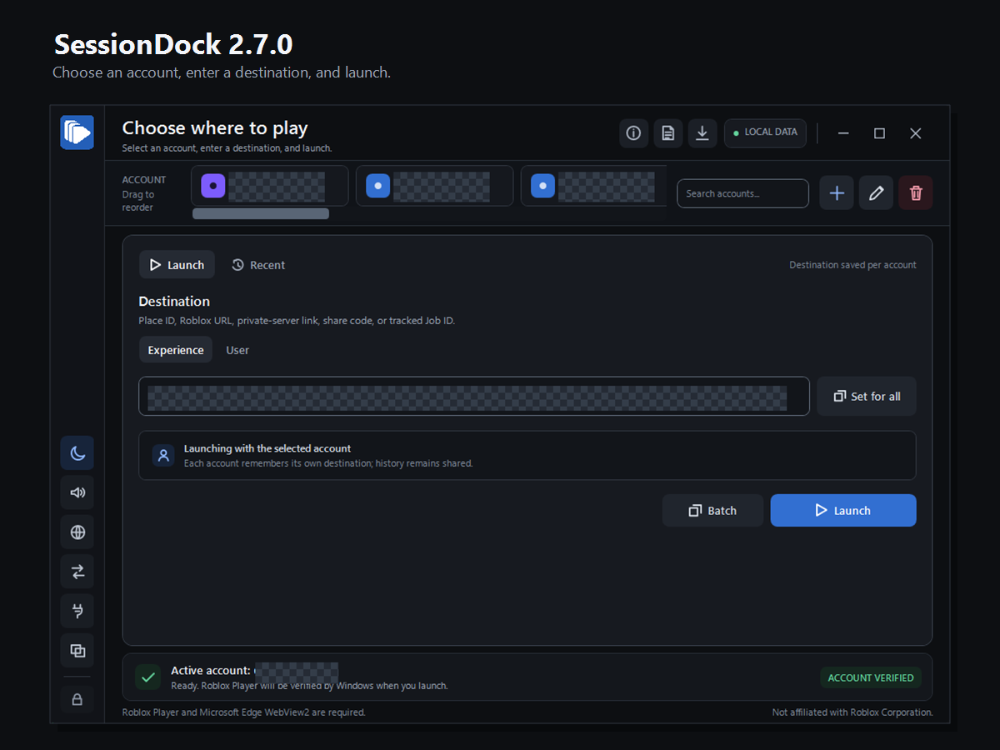

# SessionDock

[](https://github.com/Makmatoe/SessionDock/actions/workflows/ci.yml)

SessionDock is a Windows x64 launcher for Roblox. It keeps each website sign-in
in a separate local browser profile, then lets you choose the account and
destination before Roblox Player opens.

> SessionDock is an independent project. It is not affiliated with, endorsed by,
> or sponsored by Roblox Corporation. Roblox and the Roblox logo are trademarks
> of Roblox Corporation.

## Install and launch

[](https://github.com/Makmatoe/SessionDock/releases/latest/download/SessionDock-win-x64-Setup.exe)

1. Install Roblox Player on a Windows x64 PC.
2. Select **Install Latest SessionDock release** above. The link downloads
   `SessionDock-win-x64-Setup.exe` from the latest stable release in the
   canonical `Makmatoe/SessionDock` repository.
3. Confirm the browser download came from `github.com/Makmatoe/SessionDock`.
   SessionDock is not currently Authenticode-signed, so Windows may show
   **Unknown publisher** or a SmartScreen warning. Before continuing, follow
   the [checksum verification steps](docs/UPDATES.md#verify-a-manual-installer-download).
4. Open Setup as your normal Windows user. Do not run SessionDock as
   administrator; the app accepts only a non-elevated interactive user session.
5. HandleScope is already included in SessionDock 3.0. Do not download or run a
   separate HandleScope installer, PowerShell script, scheduled task, or
   autostart tool for normal SessionDock use.
6. Open SessionDock, select **Add account**, and sign in only on the official
   Roblox page shown in that account's isolated browser.
7. Select the account, choose a place, private server, saved destination, or
   supported user destination, then select **Launch Roblox**.

[View the latest release, checksums, attestations, and portable ZIP](https://github.com/Makmatoe/SessionDock/releases/latest).
If the canonical release page has no release, there is no production installer
available.

WebView2 is included with Windows 11 and nearly all Windows 10 installations.
If it is missing or damaged, SessionDock stays open and links to the
[official Microsoft WebView2 repair page](https://developer.microsoft.com/en-us/microsoft-edge/webview2/consumer/).

### If Roblox One or SessionDock 2.3.0 or earlier is installed

Do not uninstall the old app and do not run an old Setup as an upgrade. Those
versions can share the historic `%LOCALAPPDATA%\RobloxOne` data and installer
identity. Follow the
[side-by-side corrective upgrade](docs/UPDATES.md#moving-from-roblox-one-or-sessiondock-230-and-earlier)
before changing either data directory.

## Choose the right edition

| Edition | Use it for | Updates |
| --- | --- | --- |
| `SessionDock-win-x64-Setup.exe` | Normal installation | Recommended; supports the verified in-app updater |
| `SessionDock-win-x64-Portable.zip` | Temporary or portable use | Does not update itself |
| Source or raw `dotnet publish` build | Development and review | Cannot use the production self-update path |

Only assets on the canonical
[GitHub Releases page](https://github.com/Makmatoe/SessionDock/releases) are
official production builds.

## Everyday workflow

1. Add one account for each Roblox sign-in you want to isolate.
2. Give accounts labels, colors, and optional groups, then drag them into your
   preferred order.
3. Choose a destination for the selected account. Recent launches and
   favorites are shared without losing their account and public/private
   context.
4. Select **Launch Roblox** for one account, or use **Batch launch** for a
   group or preset.
5. Open **About and diagnostics** when troubleshooting. **Copy** and **Export**
   use the exact previewed, bounded text and never create or upload a support
   archive.

Useful controls:

- Press **Ctrl+F** to search the current workspace and **Escape** to clear it.
- Search accounts by label, group, username, user ID, or destination. Search
  Recent and Favorites by name, place, account, destination, or tracked server.
- Use **Close Roblox** to close verified foreground and background Roblox
  Player processes.
- Change the display language live from the sidebar. Supported choices are
  **System default**, **English (United States)**,
  **Nederlands (Nederland)**, **Deutsch (Deutschland)**,
  **Français (France)**, and **Español (España)**. System default follows a
  supported Dutch, German, French, or Spanish Windows culture and otherwise
  uses the complete English fallback. Stored dates keep their stable
  machine-readable form; display dates follow the selected culture. Very early
  startup and security-context errors use the supported Windows display
  language before the saved app preference can load.

## Main features

- **Isolated accounts:** any number of separate WebView2 profiles, custom
  labels, colors, groups, account ordering, and a remembered destination per
  account.
- **Supported destinations:** public places, official private-server links or
  codes, supported server IDs from recent launches, and an online Roblox user
  identified by exact username, user ID, or official profile URL. Roblox still
  performs the final access and privacy check when Player starts.
- **Watch and auto-join:** an explicit, cancelable, session-only user watch with
  bounded backoff, one-shot launch protection, and four-hour expiry. It is never
  saved or resumed automatically, and user destinations do not use batch mode.
- **Batch launch:** best-effort pipelining with a remembered delay, account-group
  selection, presets containing only account keys and delay, cancellation, and
  retry of failed accounts. SessionDock verifies sign-ins before closing running
  clients, requests each ticket only when needed, and restores the previously
  selected account. Starting or retrying a batch closes currently running
  verified Roblox Player clients; Roblox decides whether multiple Players may
  remain open.
- **Safe metadata transfer:** an exact-preview JSON export/import for account
  appearance, order, groups, and pinned public favorites. It never transfers
  sign-ins, local account keys, usernames, destinations, private-server data,
  JobIds, browser data, or local paths. Import matches user IDs only to accounts
  already present on the destination PC and requires confirmation.
- **Open with SessionDock:** an optional per-user Windows link handler. It never
  replaces Roblox's default handler. Every accepted link is parsed, previewed,
  assigned to an account, and separately confirmed; authentication-bearing or
  ambiguous links are rejected. Incoming private-server links are not saved.
- **Diagnostics and accessibility:** a bounded support summary, translated
  runtime/validation/accessibility text, culture-aware display dates, interface
  sounds, and an optional user-selected startup sound.
- **Included HandleScope engine:** SessionDock 3.0 contains the reviewed
  HandleScope 0.3.0 engine inside `SessionDock.exe`. Enabling it starts only a
  loopback, parent-owned child for the current SessionDock session. No separate
  download, install, PowerShell policy change, UAC prompt, scheduled task, or
  sign-in autostart is required. Application and engine updates arrive in the
  same SessionDock.exe.

The [interface tour](docs/images/sessiondock-v2.7.0/README.md) contains
sanitized SessionDock 2.7.0 captures. Personal values were replaced with a
deterministic opaque mosaic; the interface itself was not recreated or
generatively edited.



## Update SessionDock

The Setup edition updates only when you ask it to:

1. Select the update button at the top right of SessionDock.
2. If a newer stable release exists, review the version and cryptographically
   signed release notes. An older untranslated note is visibly marked as an
   English fallback.
3. Confirm the update. Canceling leaves the current version unchanged.
4. SessionDock downloads the authorized full package and verifies its signed
   filename, size, SHA-256, version, package identity, and exact content
   allowlist.
5. SessionDock exits only after verification; Velopack replaces the application
   and reopens it. A previously verified pending package can be installed by
   restarting when prompted.

Application updates do not replace account data under
`%LOCALAPPDATA%\SessionDock`. If the updater fails, keep both the current and
historic local-data directories unchanged and run the current verified Setup
from the canonical release. See [Updates for regular users](docs/UPDATES.md).

## Uninstall safely

1. If **Open with SessionDock** is enabled, open **Integrations** and disable it
   so SessionDock removes its owned per-user link-handler entries.
2. If HandleScope integration is enabled, disable it in the same panel. The
   included child also stops when SessionDock exits. If you selected a
   separately installed standalone HandleScope, SessionDock leaves that
   application, its files, and its lifecycle settings unchanged.
3. If you want an account's local WebView2 profile removed, delete that account
   in SessionDock before uninstalling.
4. Close SessionDock. In Windows, open **Settings > Apps > Installed apps**, find
   **SessionDock**, and select **Uninstall**.
5. Decide what to do with `%LOCALAPPDATA%\SessionDock`. Uninstalling application
   files does not imply deletion of account profiles, settings, favorites,
   recent history, sounds, or integration preferences. Keep the directory for a
   reinstall, or remove it only when you intentionally want to erase all
   SessionDock data for that Windows user.

Removing SessionDock removes its included HandleScope engine with the
application. It never removes an independently installed standalone
HandleScope.

## Optional HandleScope integration

SessionDock 3.0 ships the reviewed HandleScope 0.3.0 engine inside
`SessionDock.exe`. It is still disabled until you opt in, but it no longer has a
separate installation:

1. Open **Integrations > HandleScope integration**.
2. Keep **Included with SessionDock (recommended)** selected. Choose
   **Automatic**, `v2`, or `v1` for the API contract.
3. Select **Enable**. SessionDock starts and checks the selected runtime
   automatically; continue when the status is **Ready**. The readiness check
   verifies authentication, identity, metadata, and health but never enumerates
   or closes a handle.

When enabled, SessionDock starts the included engine as a non-elevated,
parent-owned child. It binds only to numeric IPv4 loopback. Its rotating token
is delivered through an inherited anonymous pipe and remains in process memory;
it is not written to a connection file, command line, environment variable,
setting, log, or UI. The child exits with SessionDock. It creates no scheduled
task, autostart entry, service, or separate uninstall entry and requires no
PowerShell execution-policy change or UAC approval.

**Standalone HandleScope (advanced)** remains available for people who already
operate the independently released application. SessionDock never downloads,
installs, updates, downgrades, starts, stops, reconfigures, or uninstalls that
copy. Selecting the advanced source only connects to an already running,
compatible standalone API through its existing protected discovery contract.
Its separate **Standalone runtime version** selector can accept any reviewed
compatible installed version automatically, keep the installed version, or
require one exact reviewed version. It is a compatibility preference only:
changing it never downloads, installs, starts, stops, updates, or downgrades
HandleScope.
Select **Refresh reviewed versions** only when you want SessionDock to fetch and
verify the latest signed compatibility catalog from GitHub. That explicit check
preserves your selection and retrieves no executable or installer.
The standalone release and its documentation remain in the canonical
[HandleScope repository](https://github.com/Makmatoe/HandleScope).

Existing `%LOCALAPPDATA%\SessionDock\handlescope.json` opt-ins remain compatible.
Separate preferences record the HandleScope source, standalone runtime-version
requirement, and API choice. All three controls are independent. Both
sources negotiate only the `v1` or `v2` operation adapter compiled into
SessionDock and enforce the same fixed Roblox singleton-event policy. See the
[SystemProcesses guide](SessionDock/SystemProcesses/README.md#handlescope-connector)
for lifecycle, migration, protocol, and maintainer synchronization details.

On the first 3.0 run, a fresh setup selects the included source. An existing 2.x
Keep installed/Exact choice, or an enabled Automatic setup with a currently
verified standalone API, is migrated to **Standalone HandleScope (advanced)**
so the upgrade does not silently replace a working source. SessionDock writes
the explicit source preference but does not change that standalone application.
If a saved exact pin no longer matches the installed standalone runtime, the
panel shows that saved choice; select **Automatic**, **Keep the installed
version**, or another reviewed exact version to recover without changing the
external installation.

## Privacy and security boundaries

SessionDock has no cloud backend, advertising, or telemetry. It does not ask
for, read, or store Roblox passwords. Account profiles, settings, favorites,
and recent-launch metadata stay under `%LOCALAPPDATA%\SessionDock`; a safe
metadata export is written only to the file you choose and is never sent by the
app.

Direct Roblox API requests and top-level sign-in navigation are limited to
official Roblox HTTPS endpoints. Embedded Roblox pages can load subresources
chosen by Roblox. Before launch, SessionDock checks the Roblox Player location
and Windows signature. The sign-in view does not load browser extensions or
password-manager integrations, but it supports normal clipboard paste and the
WebView2 context menu.

The optional generic post-launch hook accepts only authenticated HTTPS numeric
loopback endpoints and is off until configured. The included HandleScope child
has a verified parent/process boundary, inherited-pipe token bootstrap,
authenticated metadata negotiation, and rotating in-memory token. The advanced
standalone source retains its protected discovery-file and process-identity
checks. The optional link handler uses bounded same-user,
same-session IPC and only owned `HKCU\Software\Classes` entries: a SessionDock
URL ProgID, the private `sessiondock-roblox:` forwarding protocol, and an Open
With hint for safe `roblox:` links. It does not claim HTTPS or replace Roblox's
default handler. Windows exposes an invoked link in that process's command line
for the process lifetime; SessionDock clears its own startup references
promptly, keeps the value only as needed to validate/preview/confirm it, hides
private codes from the preview, and does not persist them. These are not
boundaries against another process already running as the same Windows user.

Production Windows executables are currently unsigned. Official releases
instead require a protected signed update descriptor, exact hashes, package
allowlists, SBOM, GitHub attestations, an immutable staged draft, and separate
publication approval. Those controls verify release integrity but do not make
Windows display a verified publisher.

Read [Privacy](docs/PRIVACY.md), [Security](SECURITY.md), and the manual
[accessibility verification matrix](docs/ACCESSIBILITY.md) for the complete
boundaries.

## Build and verify

Development requires Windows and the exact .NET SDK pinned in `global.json`
(currently 10.0.302). The application is self-contained with the runtime pinned
by the project (currently 10.0.10).

From the repository root:

```powershell
dotnet --info
dotnet restore .\SessionDock.slnx --locked-mode
.\scripts\Build.ps1 -Configuration Release -Runtime win-x64 -CI
```

`Build.ps1` validates repository policy and the pinned HandleScope provenance,
builds the app and release signer, runs every test project, produces a
self-contained publish, and verifies that publish. To run the desktop app while
developing:

```powershell
dotnet run --project .\SessionDock\SessionDock.csproj
```

Development output is not an official release. Local production packaging is
intentionally disabled; only the protected tag-triggered GitHub workflow can
sign release metadata, package, attest, approve, and publish production assets.
Maintainers must follow [Releasing](docs/RELEASING.md). Read
[Contributing](CONTRIBUTING.md) before proposing changes.

Official Discord announcements are generated from the versioned release notes
and sent only after the guarded GitHub publication succeeds. The separate
interactive `/release` community tool is noncanonical and cannot publish an
official release. Its deployment and recovery boundaries are documented under
[`discord-release-bot`](discord-release-bot/README.md).

## License

SessionDock is open source under the [MIT License](LICENSE.md). The included
HandleScope 0.3.0 engine is also MIT-licensed and synchronized from the
canonical HandleScope source with recorded provenance. The root MIT license and
third-party notices cover the included source without adding a release sidecar;
packages also include the SPDX SBOM, checksums, and GitHub artifact attestations.
